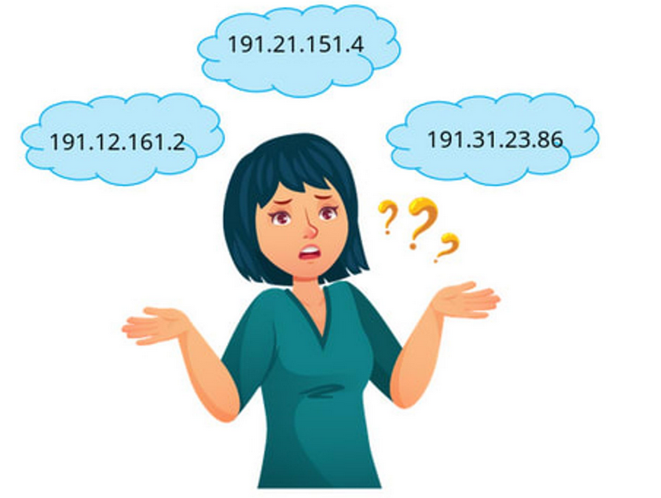

# FIVE BASIC TERMS IN WEB DEVELOPMENT

> **Cheat Sheet**

# Application Layer

## Protocols

Various applications communicate using different protocols used in application layer:

- Web Apps: HTTP, HTTPS
- Mails: POP, SMTP, IMAP
- DNS, FTP, SSH, etc.

| Layer | Application Layer |
| --- | --- |
| Protocols | DNS, HTTP, FTP, SSH, .. |
| Data Unit | Message |

## IP Address

We learned previously that each server has an IP address.

- It is very difficult to memorize the IP address.
- Things get more complicated when, as users, we access various websites and services.
- It becomes quite a challenge when the addresses of those services are dynamic.

## Accessing Websites

### URL - Uniform Resource Locator

Every object (image, html document) has a unique path (URL) on the web server

### Domain Name

## Domain Registrars

Domain Name Registrars manage the reservation of internet domain names.

## DNS: Domain Name System

- DNS is a global and highly distributed network service.
- DNS is a translation service .
- It resolves strings of letters into IP address.
- IP Addresses of these servers may change, which will appropriately be updated.

## DNS Server

There are five primary types of DNS servers:

- Root Name Servers.
- TLD Name Servers.
- Authoritative Name Servers.
- Caching Name Servers.
- Recursive Name Servers.
1. **Root Name Servers** redirect to appropriate TLD Name Server.
2. **TLD Name Server** redirect to appropriate Authoritative Name Server for the domain.
3. **Authoritative Name Server** gives the appropriate IP for the domain.
4. **Caching** and **Recursive Name Servers** are provided by ISP. These reduce the load on the root, tld, authoritative name servers.

### Root Server

- Any domain name registered in the DNS is a domain name.
- Domain names are organized in subordinate levels (subdomains) of the DNS root domain, which is nameless.

### DNS Resolution

- The first step is always to contact a root named server.
- The root servers will respond to a local DNS server with the TLD name server that should be queried like (.in). For each TLD in existence, there is a TLD name server.
- The TLD name servers will respond again to the Local DNS server with what authoritative DNS server(.ccbp.in) to contact.
- The Local DNS server could be redirected at the authoritative server for ccbp.in which would finally provide the actual IP of the server in question.

### Recursive & Caching Name Servers

- Recursive name servers are ones that perform full DNS resolution requests.
- Performs a fully recursive resolution to discover the correct IP for
www.facebook.com. This involves a bunch of steps we'll cover in just a
moment.

Since the domain name learning.ccbp.in had just been looked up, the local name server still has the IP that it resolved to stored and is able to deliver that back to your computer without having to perform a full lookup.